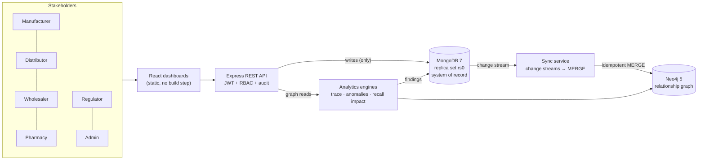

# SupplyShield

**A Real-Time Pharmaceutical Supply Chain Analytics, Traceability, Counterfeit Detection, and Recall Management Platform Using Neo4j and MongoDB**

BCSE406L NoSQL Databases · VIT Vellore · Guide: Dr. D. Vivek
Team: Vedant Patil (23BCE0816), Siya Aggarwal (23BCE0772)

SupplyShield combines established techniques (graph traversal, pattern detection, polyglot persistence) for pharma
traceability. MongoDB is the system of record for supply-chain events; a change-stream sync service mirrors the
relationships into Neo4j; graph queries power forward/backward tracing, recall impact and suspicious-movement detection.

> **All data is synthetic**, modelled on public sources (DEA ARCOS, Amico et al. 2024 distribution paths, openFDA recalls,
> FDA NDC). Anomaly detection is **five deterministic graph-pattern heuristics, not machine learning.**

---

## Architecture



- **Ingestion API writes only to MongoDB.** REST handlers never write to Neo4j.
- **Sync service** (`backend/src/services/sync.js`) runs in the same Node process as Express (decision; a separate worker is the
  production-hardening step). It watches the `entities`, `batches`, `shipments` and `recalls` collections and projects each change
  with idempotent `MERGE` statements (`graphProjector.js`). The resume token is persisted in `sync_state`, so a restart resumes where it
  stopped; with no token it opens the stream, then reconciles everything (MERGE is idempotent, so replays are harmless).
- **Graph model:** `:Manufacturer :Distributor :Wholesaler :Pharmacy :Batch :Shipment :Recall`;
  `PRODUCED, PART_OF, FROM, TO, AFFECTS, NOTIFIED{status}`; uniqueness constraints on every id.

### Anomaly detectors (`backend/src/services/anomaly.js`)

| # | Type | Rule | Severity |
|---|---|---|---|
| 1 | `duplicate_batch_fanin` | Same batch into the **same receiver** from different senders less than `ANOMALY_FANIN_WINDOW_HOURS` (6 h) apart | high |
| 2 | `multi_manufacturer_batch` | More than one `PRODUCED` edge into one batch | high |
| 3 | `reentrant_distribution` | Receiver gets the same batch more than once, receipts ≥ 6 h apart (otherwise it is a fan-in), **and** at least one of those shipments is a provenance gap | medium |
| 4 | `abnormal_fanout` | **Rolling 24 h window** of distinct receivers per sender > max(3 × network baseline, 5). Baseline = average distinct receivers per sender per calendar day (1.12 here → threshold 5). One finding per sender burst; `batch_id` = dominant batch in the window | high (medium if < 2× threshold) |
| 5 | `provenance_gap` | A sender ships a batch it neither produced nor received earlier: stock from nowhere | high |

Findings are upserted with deterministic ids, so re-runs are idempotent and never reset a reviewed/dismissed status.

---

## Local setup (Windows, no Docker)

The handoff specified Docker Compose; on request this build runs **MongoDB and Neo4j as local portable processes** instead
(no Docker or WSL on the development machine). Requirements: **Node.js 18+** ([nodejs.org](https://nodejs.org)),
**Java 17 or 21** for Neo4j (e.g. [Eclipse Temurin 21](https://adoptium.net); check with `java -version`), **Git**, ~1.5 GB disk.
Ports 4000, 27017, 7474 and 7687 must be free.

1. **Get the portable databases** into `supplyshield/.tools/` (git-ignored):
   ```powershell
   mkdir .tools; cd .tools
   curl.exe -L -o mongodb.zip https://fastdl.mongodb.org/windows/mongodb-windows-x86_64-7.0.14.zip
   curl.exe -L -o neo4j.zip https://dist.neo4j.org/neo4j-community-5.26.0-windows.zip
   Expand-Archive mongodb.zip .; Expand-Archive neo4j.zip .; del *.zip; cd ..
   ```
2. **Install and configure the backend:**
   ```powershell
   cd backend
   npm install
   copy ..\.env.example .env     # then set JWT_SECRET to a long random string
   ```
3. **Start the databases** (MongoDB as replica set `rs0`, initialised automatically; Neo4j password set on first start):
   ```powershell
   npm run db:start      # node scripts/local-db.js start   (also: db:stop, db:status)
   ```
4. **Seed** (loads MongoDB, projects into Neo4j through the sync projector, verifies counts, runs the anomaly acceptance check):
   ```powershell
   npm run seed:reset
   ```
5. **Run the app:** `npm start` → <http://localhost:4000>. Neo4j Browser: <http://localhost:7474> (neo4j / supplyshield123).
6. **Tests:** stop the app first, then `npm test` (reseeds the database; see Tests below). **Performance probe:** `npm run perf`.

On macOS/Linux the same scripts work with the corresponding MongoDB/Neo4j tarballs in `.tools/`.

### Configuration (`backend/.env`)

| Variable | Default | Meaning |
|---|---|---|
| `PORT` | 4000 | HTTP port |
| `MONGO_URI` | `mongodb://localhost:27017/supplyshield?replicaSet=rs0` | must be a replica set (change streams) |
| `NEO4J_URI` / `NEO4J_USER` / `NEO4J_PASSWORD` | `bolt://localhost:7687` / neo4j / supplyshield123 | |
| `JWT_SECRET`, `JWT_EXPIRES_IN` | — / 8h | |
| `ANOMALY_FANIN_WINDOW_HOURS` | 6 | fan-in and reentrant window |
| `ANOMALY_FANOUT_MULTIPLIER` / `ANOMALY_FANOUT_WINDOW_HOURS` | 3 / 24 | fan-out rule |
| `ANOMALY_AUTO_RUN_DEBOUNCE_MS` | 3000 | re-run detectors this long after the sync projects a batch/shipment (0 = off) |
| `APP_NOW` | `2026-08-25T00:00:00Z` | the app's "today" for **expiry checks**. Empty → real clock |

---

## Demo accounts

| Username | Password | Role | Entity | Use in demo |
|---|---|---|---|---|
| admin | Admin@123 | admin | — | users, sync health, run detection |
| regulator1 | Regulator@123 | regulator | — | anomalies, global trace, recalls, audit |
| mfg_aarav | Mfg@12345 | manufacturer | MFG-IN-00001 | register batch, ship |
| dist_national | Dist@12345 | distributor | DIST-IN-00001 | receive / ship; RBAC denial on recall |
| whs_city | Whs@12345 | wholesaler | WHS-IN-00001 | receive / ship |
| pharm_healthplus | Pharm@12345 | pharmacy | PHARM-IN-00001 | receive, verify |
| mfg_meadow | Mfg@12345 | manufacturer | MFG-IN-00015 | owns planted batches B64675, A7B41D, 0B0618 |
| mfg_sunrise | Mfg@12345 | manufacturer | MFG-IN-00002 | owns BATCH-2026-F14542 (fan-out) |
| mfg_vertex | Mfg@12345 | manufacturer | MFG-IN-00004 | owns RECALL-2026-D7457A |
| pharm_recall | Pharm@12345 | pharmacy | PHARM-IN-00042 | still `notified` on RECALL-2026-D7457A → live recall actions |
| pharm_suspect | Pharm@12345 | pharmacy | PHARM-IN-00004 | received BATCH-2025-0B0618 via provenance-gap shipments → ✕ verification |

The login page has one-click buttons for the first six accounts. The five scenario accounts (mfg_meadow, mfg_sunrise, mfg_vertex, pharm_recall, pharm_suspect) are signed in with "Sign in with a username and password instead". Passwords are bcrypt-hashed by the seed (cost 10).

## Suggested demo flow

1. `npm run db:start`, `npm run seed:reset`, `npm start`. Show `/api/health` and **Admin → Sync health** (counts match).
2. **mfg_aarav**: register a batch → ship to DIST-IN-00001 → **dist_national** confirms receipt → ships on. Sync health shows
   the events and per-event lag; Neo4j Browser shows the new nodes.
3. **Network map** of BATCH-2025-0B0618 (regulator): every company it passed through; red boxes and red dashed arrows mark
   the deliveries with no traceable source. Click a company for its part in the journey. Then **Check if genuine** at
   PHARM-IN-00023 (✓ Genuine) and, as **pharm_suspect**, at PHARM-IN-00004 (✕: both suppliers never received the batch). Try a
   made-up batch number (✕). pharm_suspect's own map shows only its part: two flagged suppliers with no link to the maker.
4. **Regulator → Suspicious activity → Run the checks now**: 9 findings grouped by batch, each with what happened and why it
   matters; "See it on the network map" opens the map. Also open the map of a recalled batch (e.g. BATCH-2026-00A6CD): each
   company shows a coloured dot for its recall response.
5. **Recall**: mfg_vertex opens RECALL-2026-D7457A → **pharm_recall** sees the alert → acknowledge → quarantine → return →
   regulator sees the progress bar move. Optionally mfg_meadow initiates a new recall (preview shows the affected entities
   from graph traversal first).
6. **Audit log** + RBAC denial (dist_national trying to recall → 403, also visible in the audit log).

---

## Seed-time data corrections (documented, deliberate)

The seed loads `data/` as-is except for these corrections, all printed by `npm run seed`:

1. **Duplicate ids in the raw data (found while building).** The generator draws 6-hex ids at random and two collide:
   `SHIP-4C61D8` is two different shipments and `TXN-71D4C6` is two different transactions. Loaded naively, the second
   overwrites the first, which silently loses a shipment and creates a **false provenance gap** for DIST-IN-00011 on
   BATCH-2025-2647E4 (a 10th anomaly). The seed re-keys the second occurrence deterministically
   (`SHIP-4C61D8` of BATCH-2025-97DF25 → `SHIP-659C9D`, `TXN-71D4C6` of BATCH-2025-35DC60 → `TXN-062A73`) and repoints the transaction
   that references the shipment. `validate_anomalies.py` never saw this because it reads CSV rows without keying by id.
2. **Recall statuses**: a recall is `completed` only if every affected entity has `returned`, else `in_progress` (6 recalls change; all 10 end up `in_progress`).
3. **Inventory `recall_status`** set from each affected entity's status (`returned`/`quarantined`; `notified`/`acknowledged` stay `none` and are
   surfaced by joining the open recall). 25 rows change.
4. **Planted second `PRODUCED` edge** `(MFG-IN-00013)-[:PRODUCED {planted:true, source:"TXN-B1D5DB"}]->(BATCH-2026-B64675)` is injected
   with Cypher: it exists only in `neo4j/batches.csv` and cannot exist in Mongo (`_id` uniqueness). Reconciliation never deletes it.

Kept as-is (decided): all 2,598 seeded shipments are `delivered`; 6 are dispatched after 2026-08-25; two batches are past expiry but
`active` (flagged at read time with `is_expired`, shown as an "Expired" badge, never rewritten); the planted shipments break inventory
conservation by design.

## Decisions where the brief was silent

- **Event timestamps use the real clock**; `APP_NOW` is used only for expiry checks. New demo shipments therefore sort after all seeded data.
- **Tests run against the same local databases and reseed first** (Neo4j Community has one database). `SKIP_SEED=1 npm test` skips the reseed.
- **New batches get manufacturer inventory** (`quantity_produced`) so they can be shipped; seeded manufacturers have no inventory rows
  (they shipped everything, which the conservation test confirms).
- **Shipments must move downstream** (manufacturer → distributor → wholesaler → pharmacy; skipping a tier is allowed, going back is not).
  Stock leaves the sender at dispatch and reaches the receiver on confirmed receipt; recalled/expired batches and quarantined stock cannot ship.
- **Authenticity (`/trace/backward`)** is `verified` only if the entity has at least one inbound shipment, **every** inbound shipment chains
  back in time order to a producer within 10 hops, and exactly one manufacturer claims the batch. Unknown batch ids return 404 with `verified:false`.
- **Recall status is forward-only** (notified → acknowledged → quarantined → returned); one open recall per batch.
- **Audit entries** are written for every mutating request including rejected ones (with the status code); passwords are redacted.
  `audit_log` and `transactions` reject updates/deletes at the Mongoose model level.
- **Anomalies are also re-run automatically** 3 s after the sync projects a batch/shipment (debounced), besides on-demand runs.
- **Recall preview endpoint** (`POST /recalls/preview`) added so the UI can show affected entities before confirming.
- **Plain-language UI:** screens use everyday words ("Stock from an unknown source", "Check if genuine", "Set aside") with
  the technical term shown small where it matters. All UI wording lives in `backend/public/js/copy.jsx`. Mapping to the report's
  terms: Network map = forward trace (FR-4); Check if genuine = backward trace (FR-4); Suspicious activity = anomaly detection
  (FR-5); System status = sync health; Activity log = audit log (FR-10).
- **Network map scoping:** regulator, admin and the batch's manufacturer see a batch's whole map. Distributors, wholesalers and
  pharmacies see only the deliveries leading to them and from them, so they can trace their stock without seeing competitors' business.

## What was actually verified vs. not

**Verified by running it** (MongoDB 7.0.14 replica set + Neo4j 5.26.0 Community, locally, 2026-10-08):
- Seed: Mongo counts 135 / 500 / 2,598 / 2,591 / 2,599 / 10 / 11 users; Neo4j 135 entities, 500 Batch, 2,598 Shipment, 10 Recall,
  **501 PRODUCED** edges. ~6 s.
- Anomaly detection against Neo4j returns **exactly the 9 expected documents** from the handoff; 22 provenance-gap shipments;
  fan-out baseline 1.12 → threshold 5, DIST-IN-00001 reaches 18, next-highest sender 4; none of the 10 organic repeat-receipt pairs flagged.
- Backward trace: BATCH-2025-0B0618 verifies at PHARM-IN-00023 via MFG-IN-00015 → DIST-IN-00013 → WHS-IN-00019 and fails at
  PHARM-IN-00004 (breaks at WHS-IN-00028 / WHS-IN-00033).
- Jest: **55 tests pass** (`npm test`) covering auth, RBAC, batches/shipments/receipt with inventory conservation, trace, anomaly acceptance +
  idempotency, recall initiation (affected set = forward-trace recipients) and completion, sync (< 5 s), audit immutability.
- Performance numbers in [`docs/PERFORMANCE.md`](docs/PERFORMANCE.md) are real measurements on one laptop.
- UI: every role's views were exercised in a browser (Chromium) against the running app.

**Not verified / not done:**
- **Docker Compose was not built** (skipped on request); only the local-process setup above has been run.
- Scalability (10M nodes / 50M relationships) is a design target; nothing at that scale was tested.
- The 10-hop NFR: the dataset's longest supply chain is 3 entity hops; deeper traversal was only probed synthetically (see PERFORMANCE.md).
- The UI was checked manually; there are no automated browser tests.
- Deletes in MongoDB are not projected to Neo4j (no API deletes graph-relevant data).

## Limitations

Synthetic data · heuristic (rule-based, non-ML) detection whose thresholds were set from the brief, not tuned on real incidents ·
single-node demo deployment · scalability is a design target, not a benchmark · the sync service runs in the API process ·
JWTs are stateless (no revocation list) · front end compiles JSX in the browser (fine for a demo, not for production).

## Repository layout

```
data/                 dataset (MongoDB JSON, Neo4j CSVs + load_graph.cypher, generator, validator)
docs/API.md           REST reference          docs/PERFORMANCE.md   measured numbers
backend/
  scripts/            seed.js · local-db.js (start/stop DBs) · perf.js
  src/config          env, mongo (replica-set check), neo4j driver
  src/models          Mongoose schemas (append-only plugin for audit_log + transactions)
  src/middleware      auth (JWT), rbac, audit, error
  src/services        graphProjector, sync, traceability, anomaly, recall, scope
  src/routes          auth, entities, batches, shipments, inventory, transactions, trace, anomalies, recalls, alerts, admin
  public/             index.html, css/, js/ (React 18 + Babel Standalone from CDN, no build step)
  tests/              Jest + supertest
```

`data/validate_anomalies.py` is the offline Python reference implementation of the detector rules (`python data/validate_anomalies.py`).
